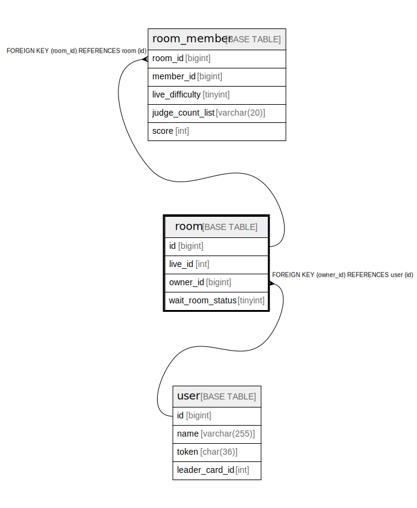

# room

## Description

<details>
<summary><strong>Table Definition</strong></summary>

```sql
CREATE TABLE `room` (
  `id` bigint NOT NULL AUTO_INCREMENT,
  `live_id` int NOT NULL,
  `owner_id` bigint NOT NULL,
  `wait_room_status` tinyint NOT NULL,
  PRIMARY KEY (`id`),
  KEY `owner_id` (`owner_id`),
  KEY `wait_room_status_live_id` (`wait_room_status`,`live_id`),
  CONSTRAINT `room_ibfk_1` FOREIGN KEY (`owner_id`) REFERENCES `user` (`id`)
) ENGINE=InnoDB DEFAULT CHARSET=utf8mb4 COLLATE=utf8mb4_0900_ai_ci
```

</details>

## Columns

| Name | Type | Default | Nullable | Extra Definition | Children | Parents | Comment |
| ---- | ---- | ------- | -------- | ---------------- | -------- | ------- | ------- |
| id | bigint |  | false | auto_increment | [room_member](room_member.md) |  |  |
| live_id | int |  | false |  |  |  |  |
| owner_id | bigint |  | false |  |  | [user](user.md) |  |
| wait_room_status | tinyint |  | false |  |  |  |  |

## Constraints

| Name | Type | Definition |
| ---- | ---- | ---------- |
| PRIMARY | PRIMARY KEY | PRIMARY KEY (id) |
| room_ibfk_1 | FOREIGN KEY | FOREIGN KEY (owner_id) REFERENCES user (id) |

## Indexes

| Name | Definition |
| ---- | ---------- |
| owner_id | KEY owner_id (owner_id) USING BTREE |
| wait_room_status_live_id | KEY wait_room_status_live_id (wait_room_status, live_id) USING BTREE |
| PRIMARY | PRIMARY KEY (id) USING BTREE |

## Relations



---

> Generated by [tbls](https://github.com/k1LoW/tbls)
