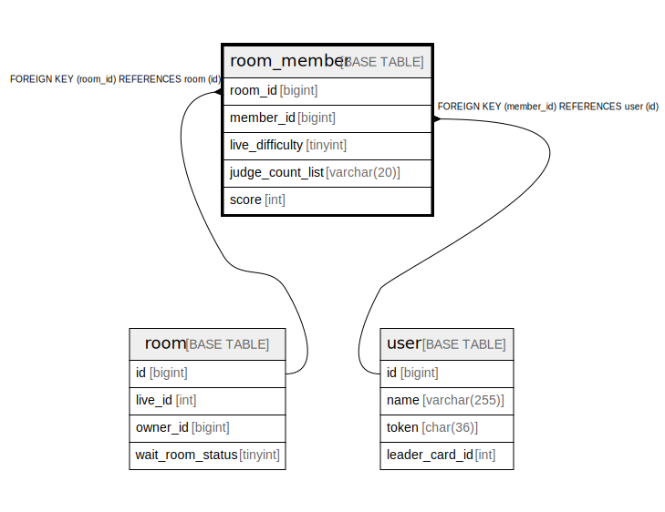

# room_member

## Description

<details>
<summary><strong>Table Definition</strong></summary>

```sql
CREATE TABLE `room_member` (
  `room_id` bigint NOT NULL,
  `member_id` bigint NOT NULL,
  `live_difficulty` tinyint NOT NULL,
  `judge_count_list` varchar(20) DEFAULT NULL,
  `score` int DEFAULT NULL,
  PRIMARY KEY (`room_id`,`member_id`),
  KEY `member_id` (`member_id`),
  CONSTRAINT `room_member_ibfk_1` FOREIGN KEY (`room_id`) REFERENCES `room` (`id`),
  CONSTRAINT `room_member_ibfk_2` FOREIGN KEY (`member_id`) REFERENCES `user` (`id`)
) ENGINE=InnoDB DEFAULT CHARSET=utf8mb4 COLLATE=utf8mb4_0900_ai_ci
```

</details>

## Columns

| Name | Type | Default | Nullable | Children | Parents | Comment |
| ---- | ---- | ------- | -------- | -------- | ------- | ------- |
| room_id | bigint |  | false |  | [room](room.md) |  |
| member_id | bigint |  | false |  | [user](user.md) |  |
| live_difficulty | tinyint |  | false |  |  |  |
| judge_count_list | varchar(20) |  | true |  |  |  |
| score | int |  | true |  |  |  |

## Constraints

| Name | Type | Definition |
| ---- | ---- | ---------- |
| PRIMARY | PRIMARY KEY | PRIMARY KEY (room_id, member_id) |
| room_member_ibfk_1 | FOREIGN KEY | FOREIGN KEY (room_id) REFERENCES room (id) |
| room_member_ibfk_2 | FOREIGN KEY | FOREIGN KEY (member_id) REFERENCES user (id) |

## Indexes

| Name | Definition |
| ---- | ---------- |
| member_id | KEY member_id (member_id) USING BTREE |
| PRIMARY | PRIMARY KEY (room_id, member_id) USING BTREE |

## Relations



---

> Generated by [tbls](https://github.com/k1LoW/tbls)
