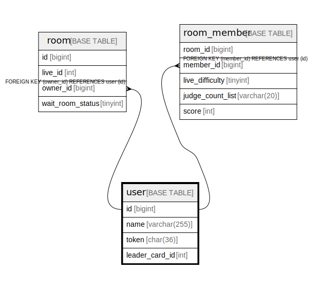

# user

## Description

<details>
<summary><strong>Table Definition</strong></summary>

```sql
CREATE TABLE `user` (
  `id` bigint NOT NULL AUTO_INCREMENT,
  `name` varchar(255) NOT NULL,
  `token` varchar(255) NOT NULL,
  `leader_card_id` int NOT NULL,
  PRIMARY KEY (`id`),
  UNIQUE KEY `token` (`token`)
) ENGINE=InnoDB DEFAULT CHARSET=utf8mb4 COLLATE=utf8mb4_0900_ai_ci
```

</details>

## Columns

| Name | Type | Default | Nullable | Extra Definition | Children | Parents | Comment |
| ---- | ---- | ------- | -------- | ---------------- | -------- | ------- | ------- |
| id | bigint |  | false | auto_increment | [room](room.md) [room_member](room_member.md) |  |  |
| name | varchar(255) |  | false |  |  |  |  |
| token | varchar(255) |  | false |  |  |  |  |
| leader_card_id | int |  | false |  |  |  |  |

## Constraints

| Name | Type | Definition |
| ---- | ---- | ---------- |
| PRIMARY | PRIMARY KEY | PRIMARY KEY (id) |
| token | UNIQUE | UNIQUE KEY token (token) |

## Indexes

| Name | Definition |
| ---- | ---------- |
| PRIMARY | PRIMARY KEY (id) USING BTREE |
| token | UNIQUE KEY token (token) USING BTREE |

## Relations



---

> Generated by [tbls](https://github.com/k1LoW/tbls)
